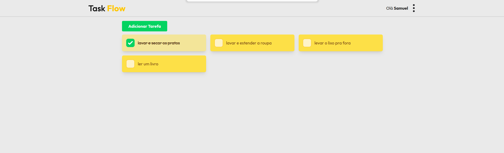
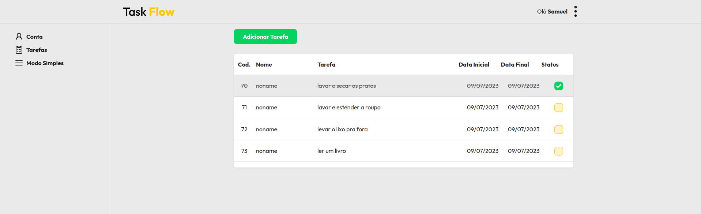

# Task Flow

Este é um simples aplicativo web de Lista de Tarefas construído com Next.js. Ele permite que você crie, gerencie e organize suas tarefas em uma interface intuitiva e fácil de usar. A aplicação possui frontend em Nextjs e necessita de uma api em Node.js para rodar.

<div align="center">
  
</div>

<div align="center">
  
</div>

## Deploy

https://task-flow-23.netlify.app

## Recursos

- Cadastre usuários para acesso personalizado.
- Adicione novas tarefas com um título, descrição e datas no modo avançado.
- Adicione novas tarefas com descrição no modo simples.
- Marque as tarefas como concluídas.
- Edite os detalhes das tarefas, como título e descrição.
- Exclua tarefas que não são mais necessárias.
## Tecnologias Utilizadas

- Next.js: Um framework React para construir aplicações renderizadas no servidor.
- TypeScript: Uma linguagem de programação que adiciona tipagem estática ao JavaScript.
- Tailwind CSS: Um framework CSS utilitário para projetar componentes de IU responsivos e personalizáveis.
- Zod: Uma biblioteca de validação de esquemas para JavaScript e TypeScript.
- React Hook Form: Uma biblioteca de formulários eficiente para React.
## Configuração

1. Clone este repositório em sua máquina local:

```bash
  git clone https://github.com/samuelsilvati/task-flow
```
2. Navegue até o diretório do projeto:

```bash
  cd task-flow
```
3. Instale as dependências do projeto:

```bash
  npm install
```
4. Configure as variáveis de ambiente:

- Renomeie o arquivo .env.example para .env.
- Abra o arquivo .env e configure as variáveis de ambiente.

5. lembre-se de configurar a api : https://github.com/samuelsilvati/task-flow-api
- Execute a aplicação com o comando:
```bash
    npm run dev
```
O servidor será iniciado e estará disponível em http://localhost:3000.

## Licença

Este projeto está licenciado sob a Licença MIT. Consulte o arquivo [LICENSE](/LICENSE) para obter mais informações.

[](https://choosealicense.com/licenses/mit/)

